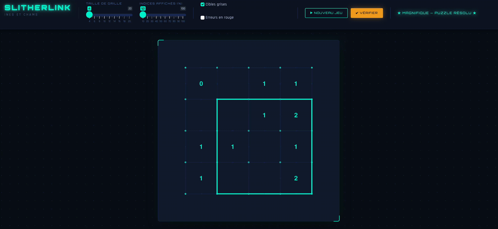

# SLITHERLINK 

## Introduction
Voici notre projet slitherlink, c'est une web app R shiny qui permet de jouer au jeu slitherlink avec plus ou moins de difficulté en fonction des exigences de l'utilisateur.
Le gif ci-dessous montre l'aspect de la web-app et son utilisation en temps réel.

<p align="center">
  
</p>

## Installation

```r
install.packages(c("shiny", "bslib"))
shiny::runApp("slitherlink_app_ines_chams/app.R")
```

---

## La règle en une phrase

Chaque chiffre dit combien de ses côtés font partie de la boucle.
Le but est de former **une seule boucle fermée** qui respecte tout les consignes de chaque cases.

```
+   +   +   +
  2   1   2
+   +   +   +
  1   0   1
+   +   +   +
  2   1   2
+   +   +   +
```

La solution dans cet exemple est le rectangle extérieur.
---

## Réglages

Il est possible de choisir la taille de la grille (de 4 à 20) et le pourcentage d'indice affichés (de 10% à 100%). De plus des aides telles que les indice en rouges sont possibles.
---

## Fonctionnement

Le code est découpé en 4 grandes étapes, dans l'ordre :

### Étape A — Créer une forme

Nous avons choisi de partir du centre de la grille et d'agrandir notre forme en ajoutant aléatoirement des cases en bordure de la forme jusqu'à atteindre une taille cible. 

### Étape B — Définir le contour de la forme

On parcourt toutes les frontières entre l'intérieur et l'extérieur de la forme. Chaque frontière devient un trait de la solution. 
On a décomposé les solutions en deux matrices, `solution_h` qui contient les trait horizontaux et `solution_v` les traits verticaux.

### Étape C — Comptage des cotés

Pour chaque case, on compte combien de ses 4 côtés appartiennent à la solution et nous enregistrons cela dans la variable chiffres_indices.

### Étape D — Retirer des indices tout en gardant une solution unique

Pour avoir la garantie que le jeu dispose d'une solution unique peu importe les chiffres retirés, nous n'avons pas réellement trouvé de solution élégante. Ainsi nous avons décidé d'utiliser un solveur à chaque retrait de chiffre afin de vérifier si une ou plusieurs solution étaient trouvées. Dès l'instant où plusieurs solutions étaient trouvés
Pour chaque chiffre à retirer, on demande au **solveur** de compter le nombre de solutions si ce chiffre disparaît :

- **1 solution** → on peut retirer l'indice en toute sécurité 
- **2 solutions ou plus** → on le remet, le puzzle deviendrait ambigu ❌

Le solveur utilise **propagation de contraintes** (deux règles logiques appliquées en boucle) puis **backtracking** si ça se bloque, et vérifie la connexité de la boucle par **BFS** en fin de compte. Tout ça pour garantir qu'il n'existe qu'une seule solution possible.

```
Avant retrait :      Après retrait :

 0  1  1  1  0        ·  ·  1  ·  ·
 1  2  2  3  1        ·  2  ·  3  ·
 1  2  1  3  1   →    1  ·  ·  3  1
 0  2  2  3  1        ·  2  ·  ·  ·
 0  0  1  1  0        0  ·  ·  1  ·

Les · = indices retirés. Le solveur a vérifié chacun.
```

---

## Comment engager une partie ?

```
NOUVEAU JEU
    │
    └─→ generer_grille_slitherlink()
            ├── Forme aléatoire
            ├── Solution h/v
            ├── Chiffres complets
            └── Retrait des indices (solveur)
                        │
                        ▼
              chiffres_visibles + solution stockés

CLIC JOUEUR
    │
    └─→ distance euclidienne vers chaque trait
            └── < 0.45 ? → basculer (0↔1) → redessiner

VÉRIFIER
    │
    └─→ sum(|traits_joueur - solution|)
            ├── 0 → 🏆 Victoire
            └── > 0 → "X erreur(s) restante(s)"
```

---

## Structure du code

```
slitherlink.R
├── Section 0 — Solveur
│     obtenir_aretes_cellule / sommet
│     lire_arete / ecrire_arete
│     propager_contraintes
│     verifier_boucle_unique
│     compter_solutions  ←  backtrack() récursif interne
│     retirer_indices
│
├── Section 1 — Génération
│     generer_grille_slitherlink()
│
├── Section 2 — UI
│     Barre de contrôle horizontale + zone de jeu
│
└── Section 3 — Serveur
      observeEvent  ×3  (nouveau jeu, clic, vérifier)
      renderUI      ×2  (statut haut, statut bas)
      renderPlot    ×1  (dessin en 4 couches)
```

---

## Les matrices en jeu (exemple 5×5)

| Matrice | Dimensions | Contenu |
|---|---|---|
| `solution_h` | 6 × 5 | Traits horizontaux de la solution (0/1) |
| `solution_v` | 5 × 6 | Traits verticaux de la solution (0/1) |
| `chiffres` | 5 × 5 | Indices complets (0 à 4) |
| `chiffres_visibles` | 5 × 5 | Indices affichés (certains = NA) |
| `traits_joueur_h` | 6 × 5 | Ce que le joueur a posé en horizontal |
| `traits_joueur_v` | 5 × 6 | Ce que le joueur a posé en vertical |

Total d'arêtes possibles : `2nm + n + m` = **60** pour une grille 5×5.

---

> Fait en R avec Shiny
